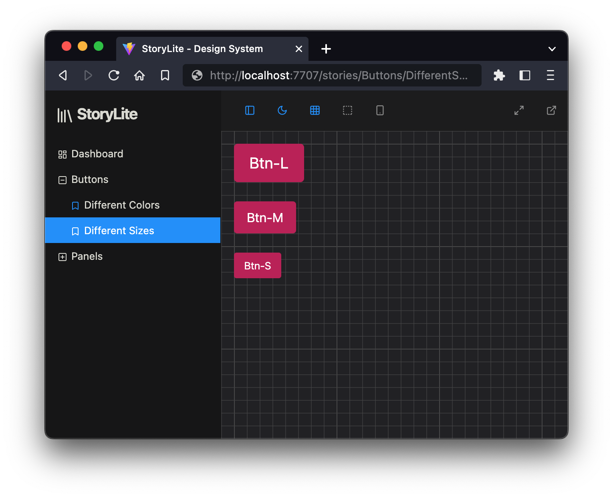

# storylite

<p>
  <a href="https://npmjs.com/package/@storylite/storylite"></a>
  <a href="https://github.com/itsjavi/storylite/actions/workflows/ci.yml"></a>
  <!--<a href="https://itsjavi.com/storylite?sandbox"></a>-->
  <a href="https://itsjavi.com/storylite"></a>
</p>

StoryLite is a modern and lightweight tool for developing and managing design systems and components. It is inspired by
the popular StoryBook UI and built on top of Vite⚡️, offering a streamlined and user-friendly experience.

With StoryLite, individuals and teams can quickly create, test, and iterate on their UI components in isolation to
ensure consistency across the application.

Designed for small projects that don't require all the features and complexity of a full-blown StoryBook setup,
StoryLite provides a familiar UI that is easy to use and customize to each team's unique needs.



## Features

- Lightweight and customizable, with a minimal set of dependencies.
- Small project that can be used either as a template or as a standalone server.
- Addons system with the basics (dark mode, viewport size, grid, outline, fullscreen, etc.).
- Customizable via `storylite.config.js` file (or `.ts`).
- Supports `.stories.jsx` and `.stories.tsx` stories.

## Limitations

- Currently, there is no support for things such as "auto docs", "code snippets", "knobs", "controls", "actions"
  or "events".
- It has only been tested with React components, but it should work with any framework that Vite supports. Support
  and/or fixes for Vue, Svelte, Solid, and others is welcome via PRs.
- No support for MDX files, to keep the project simple, but adding support via PRs is welcome as long as it doesn't
  add too much complexity.
- Changes to the config file will require a full server restart at the moment.

## Usage

(WIP)

## Installation

To install StoryLite, simply run one of the following commands:

```bash
# Using npm
npm install -D @storylite/storylite

# Using yarn
yarn add -D @storylite/storylite

# Using pnpm
pnpm add -D @storylite/storylite
```

## Roadmap

### Features

- [ ] Addons:
  - [ ] Different responsive sizes + custom size
  - [ ] Zoom in/out
  - [ ] Accessibility
- [ ] Multiple resizable viewports (side by side)
- [ ] Create `packages/examples` package
  - [ ] Try out with React, Vue, Svelte, Solid, and Qwik.

### Technical

- [ ] Provide documentation (`packages/docs`)
  - [ ] Use Nextra https://nextra.site/
  - [ ] Host in GitHub Pages (build and deploy via GitHub Actions)
- [ ] Better handling of the iframes
- [ ] Better addons API
- [ ] Use redux-toolkit
- [ ] SSR/SSG support
- [ ] Stories format compatible with Storybook (backwards compatible with SB v6 and v7)
- [ ] Better mobile experience (specially for sidebars and toolbars)

## Contributing

Contributions are welcome! Please read the [contributing guidelines](./CONTRIBUTING.md) before submitting a PR.

## License

[MIT License](./LICENSE)

## Acknowledgements

Inspired by:

- [StoryBook](https://storybook.js.org/)
- [Ladle](https://ladle.dev/)

Built with:

- [Vite](https://vitejs.dev/)
- [React](https://react.dev/)
